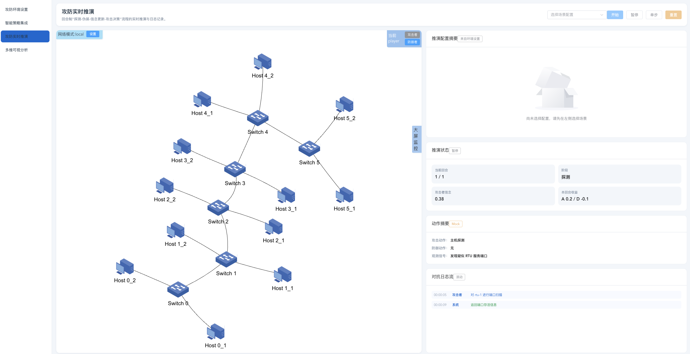
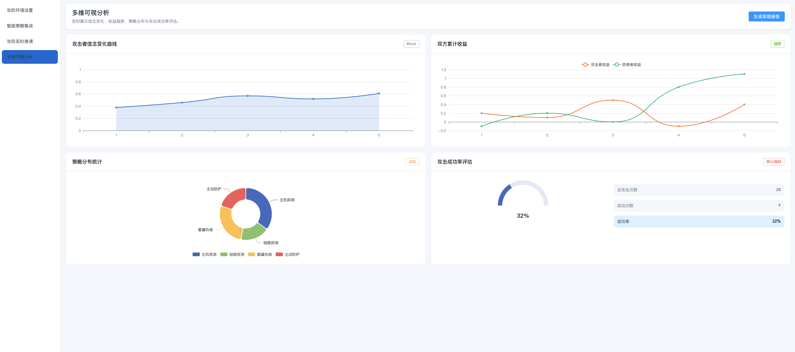

# CyberGaming Simulator (攻防博弈仿真平台)

基于 Electron + Vue 3 的网络攻防博弈仿真与推演前端平台。支持环境配置、实时推演、智能策略集成及多维可视分析。

## ✨ 主要功能

*   **攻防环境设置**: 配置攻防双方环境与行动策略，可视化编辑网络拓扑。
*   **攻防实时推演**: 回合制“探测-伪装-信念更新-攻击决策”实时推演与日志记录。
*   **智能策略集成**: 强化学习模型训练、管理与推理配置。
*   **多维可视分析**: 实时展示信念变化、收益趋势与策略分布。


## 📸 界面预览




## 🛠️ 安装与运行

### 前置要求
*   Node.js (建议 v16+)
*   npm

### 1. 安装依赖
```bash
npm install

### 2. 启动 Electron
npm run electron:serve
# 或者
npm start